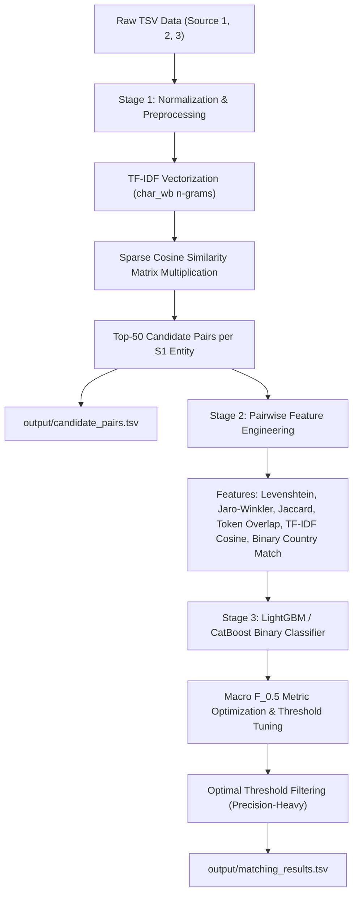

# Implementation Plan - Business Entity Resolution Pipeline

This plan outlines the architecture, data processing, candidate blocking, feature engineering, machine learning modeling, macro $F_{0.5}$ evaluation metric, and inference pipeline for the **Business Entity Resolution Challenge**.

## User Review Required

> [!IMPORTANT]
> - **Tab-Separated Files (`.tsv`)**: All input and output files are tab-separated (`sep="\t"`). Addresses and ID lists contain commas, so explicit tab separation is enforced throughout.
> - **Open-Set Country Field**: `country` contains US and India in training data, but test data includes unseen countries (e.g. France). The pipeline uses string normalization and exact binary comparison (`s1.country == cand.country`) without hardcoding or one-hot encoding country categories.
> - **Macro $F_{0.5}$ Evaluation Metric**: $F_{0.5}$ weights precision twice as heavily as recall ($F_{0.5} = \frac{1.25 \times P \times R}{0.25 \times P + R}$). Singletons (entities with 0 matches) receive 1.0 score when correctly predicted empty, and 0.0 when false matches are predicted. The prediction probability threshold is tuned to maximize macro $F_{0.5}$.

---

## Proposed Pipeline Architecture

---

## Component Details

### 1. `preprocess.py`
- Reads `.tsv` files explicitly with `pd.read_csv(path, sep="\t")`.
- Normalization function `normalize_text(text)`:
  - Converts to lowercase and strips leading/trailing whitespace.
  - Standardizes business and address abbreviations (`corp` $\rightarrow$ `corporation`, `inc` $\rightarrow$ `incorporated`, `ltd` $\rightarrow$ `limited`, `pvt` $\rightarrow$ `private`, `rd` $\rightarrow$ `road`, `st` $\rightarrow$ `street`, `ave` $\rightarrow$ `avenue`, `blvd` $\rightarrow$ `boulevard`, `co` $\rightarrow$ `company`, `dept` $\rightarrow$ `department`, `&` $\rightarrow$ `and`).
  - Removes non-alphanumeric punctuation while maintaining whitespace.
- Generates `combined_text` column: `normalized_name + " " + normalized_address`.

### 2. `blocking.py`
- Transforms `combined_text` using `TfidfVectorizer(analyzer='char_wb', ngram_range=(3,4))`.
- Fits vectorizer on combined corpus of Source 1, Source 2, and Source 3.
- Efficient candidate search using sparse dot product: `cosine_sim = S1_tfidf.dot(S2_S3_tfidf.T)`.
- Extract top 50 candidates from S2 + S3 for each S1 entity.
- Formats candidate list into comma-separated strings and saves `output/candidate_pairs.tsv` adhering strictly to submission criteria.

### 3. `feature_engineering.py`
- Computes comprehensive pairwise similarity features between `Source 1` record and candidate `(Source 2 / 3)` record:
  1. `name_levenshtein_ratio`: Character Levenshtein similarity ratio for business names.
  2. `name_jaro_winkler`: Jaro-Winkler distance for business names.
  3. `name_jaccard`: Token-level Jaccard similarity for business names.
  4. `name_token_overlap_count`: Count of common tokens between names.
  5. `name_token_overlap_ratio`: Overlap count normalized by max token count.
  6. `address_levenshtein_ratio`: Character Levenshtein similarity ratio for addresses.
  7. `address_jaro_winkler`: Jaro-Winkler distance for addresses.
  8. `address_jaccard`: Token-level Jaccard similarity for addresses.
  9. `address_token_overlap_count`: Count of common tokens between addresses.
  10. `address_token_overlap_ratio`: Overlap count normalized by max token count.
  11. `tfidf_cosine_combined`: TF-IDF cosine similarity of combined text.
  12. `tfidf_cosine_name`: TF-IDF cosine similarity of names.
  13. `tfidf_cosine_address`: TF-IDF cosine similarity of addresses.
  14. `country_match`: Binary feature (`1` if exact string match, `0` otherwise).
  15. `length_diff_name`: Absolute character length difference between names.
  16. `length_diff_address`: Absolute character length difference between addresses.

### 4. `train.py`
- Expands `train_ground_truth.tsv` into positive pairs `(s1, matched_id)`.
- Merges candidate set with ground truth to create binary classification labels (`1` for true match, `0` for non-match candidate).
- Splits training entities into 80% train / 20% validation split (grouped by Source 1 entity ID to prevent data leakage).
- Trains `LightGBM` / `CatBoost` binary classifier.
- Implements custom macro $F_{0.5}$ metric computation:
  - Evaluates macro average $F_{0.5}$ across all validation entities (including singletons).
  - Performs grid search over probability thresholds $\theta \in [0.10, 0.95]$ to find optimal threshold $\theta^*$.
- Saves model and optimal threshold to `models/model.pkl`.

### 5. `inference.py`
- Reads test set (`test_source1.tsv`, `test_source2.tsv`, `test_source3.tsv`).
- Executes candidate blocking to generate `output/candidate_pairs.tsv`.
- Extracts similarity features for all candidate pairs.
- Predicts match probabilities using trained model.
- Filters candidate pairs with probability $\ge \theta^*$.
- Formats final output `output/matching_results.tsv` (one row per Source 1 entity, tab-separated, comma-separated matched entity IDs, empty string for singletons).

### 6. `run_pipeline.py` & Validation Tools
- `utils/generate_sample_data.py`: Synthetic dataset generator matching real dataset schema, noise patterns (abbreviations, typos, address format variations), and singleton ratios.
- `utils/validate_submission.py`: Validator verifying line count, tab formatting, ID validity, singleton handling, and subset constraint.

---

## Verification Plan

### Automated Verification
- Run synthetic data generation to ensure full dataset directory layout (`dataset/train/`, `dataset/test/`).
- Run `python run_pipeline.py` end-to-end.
- Validate `output/candidate_pairs.tsv` and `output/matching_results.tsv` using `utils/validate_submission.py`.
- Run unit test suite checking string distance functions, macro $F_{0.5}$ metric calculation, and vectorizer candidate generation.

### Manual Verification
- Inspect generated TSV files to verify exact column names, tab separation, and singleton formatting.
